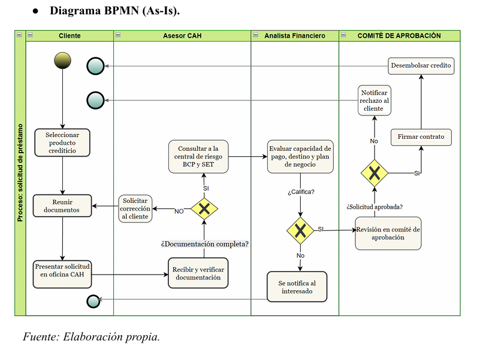
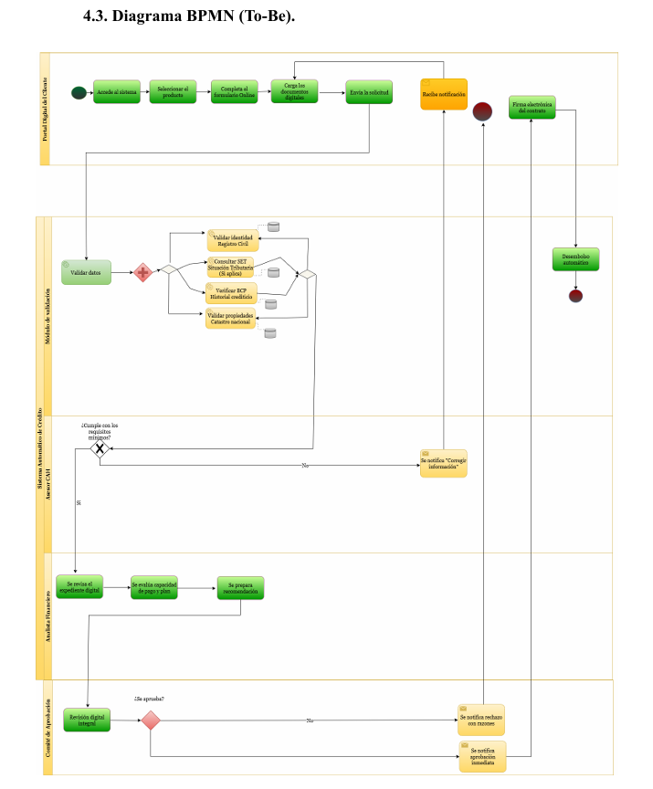
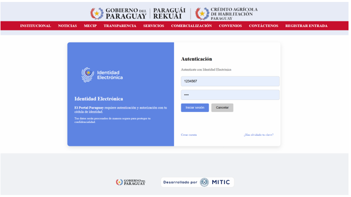
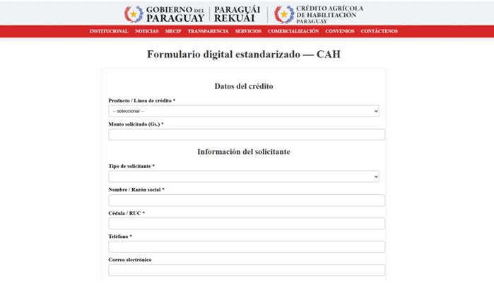
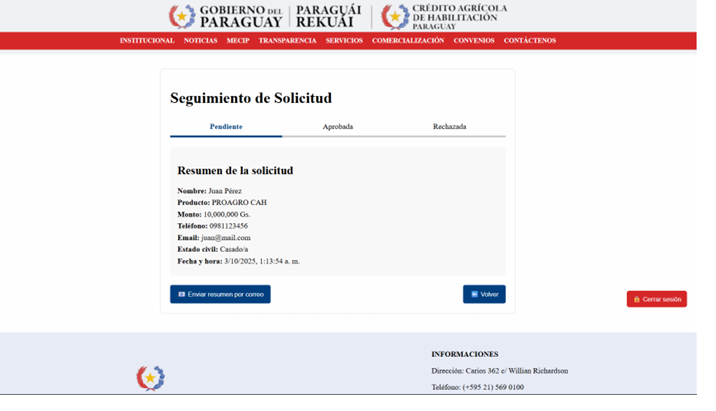

# CAH Business Process Analysis

## Project Overview

This project focused on analyzing and redesigning the credit application process of Crédito Agrícola de Habilitación (CAH).

The objective was to identify operational inefficiencies in the existing process, model the current workflow (AS-IS), design an improved future-state process (TO-BE), and propose a digital solution to improve efficiency, transparency, and customer experience.

---

## Business Problem

The original credit application process relied heavily on manual document handling, multiple validation steps, and limited digital integration.

Key challenges identified:

- Manual document submission
- Repeated validation activities
- Limited process traceability
- High administrative workload
- Long approval times

---

## Methodology

- Business Process Analysis
- BPMN Process Modeling
- AS-IS / TO-BE Analysis
- Process Improvement
- Digital Transformation Proposal

---

## Current Process (AS-IS)

The existing process required customers to gather documentation, submit applications in person, and wait for multiple manual validation stages.

---

## Proposed Process (TO-BE)

The redesigned process introduces digital validation, online application submission, automated checks, and electronic notifications.

---

## Proposed Digital Solution

The project proposed a digital credit application platform including:

- Online application submission
- Digital identity authentication
- Automated document validation
- Application status tracking
- Electronic contract signing
- Notification system

---

## Prototype Screens

### Login Screen

### Digital Credit Application Form

### Application Tracking Dashboard

---

## Key Performance Indicators (KPIs)

The proposed solution included the definition of performance indicators such as:

- Credit approval cycle time
- Percentage of complete applications submitted on first attempt
- Percentage of applications processed digitally

---

## Skills Demonstrated

- Business Analysis
- BPMN Modeling
- Process Improvement
- Process Documentation
- Digital Transformation
- Requirements Analysis
- KPI Definition
- Problem Solving

---

## Technologies & Concepts

- BPMN
- Process Modeling
- Business Process Management
- Digital Transformation
- Information Systems Analysis
